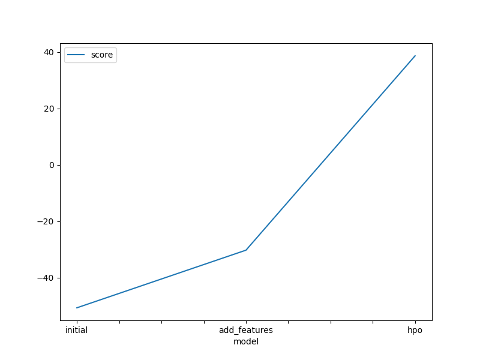
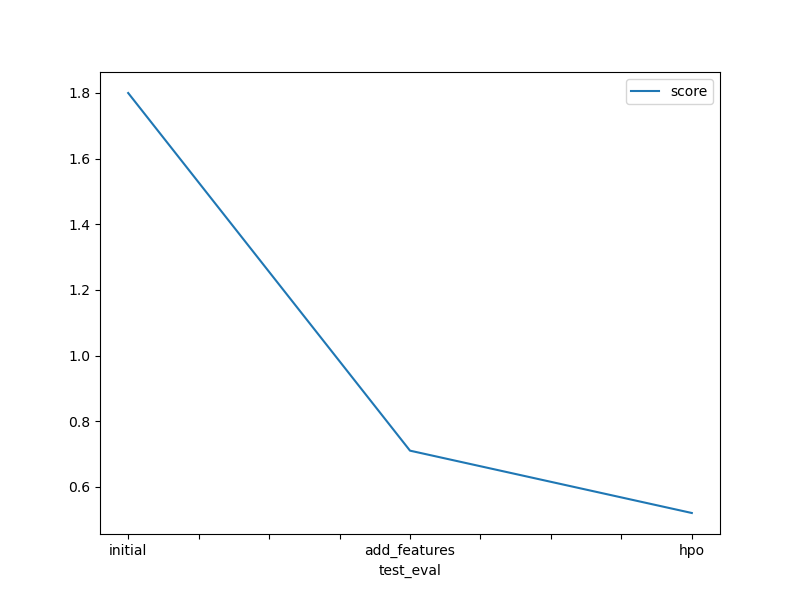

# Report: Predict Bike Sharing Demand with AutoGluon Solution
#### Yousef Salem

## Initial Training
### What did you realize when you tried to submit your predictions? What changes were needed to the output of the predictor to submit your results?
Nothing needed to change all the predictions were positive values and there weren't negative.

### What was the top ranked model that performed?
WeightedEnsemble_L2

## Exploratory data analysis and feature creation
### What did the exploratory analysis find and how did you add additional features?
In EDA I extracted the year, month, day and hour from datetime column.
### How much better did your model preform after adding additional features and why do you think that is?
The score reduced from 1.80 to .71 and i think this is because the model got extra features to train on them. 
## Hyper parameter tuning
### How much better did your model preform after trying different hyper parameters?
The score went from .71 to .52 but still didn't preform better than the previous one.

### If you were given more time with this dataset, where do you think you would spend more time?
I would spend time with Feature Enginnering to get the most of the data
### Create a table with the models you ran, the hyperparameters modified, and the kaggle score.
|model|NN|GBM|RF|score|
|--|--|--|--|--|
|initial|default|default|default|1.80|
|add_features|default|default|default|.71|
|hpo|nn_options|GBM_options|RF_options|.52|

### Create a line plot showing the top model score for the three (or more) training runs during the project.

TODO: Replace the image below with your own.

### Create a line plot showing the top kaggle score for the three (or more) prediction submissions during the project.

TODO: Replace the image below with your own.

## Summary
The better EDA and features enginnering the better performance you will get from the model.